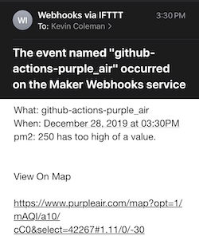
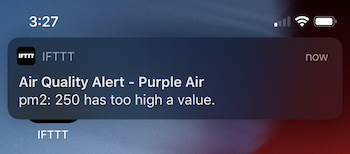
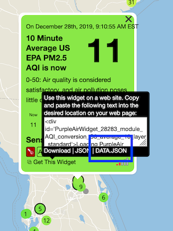

# Purple Air Air Quality Monitor Alerts

Receive alerts every 30 minutes about the air quality of your private (or public) sensor. Unofficial

# Features

## Push notifications

## Email notifications

# Quick Start

## Step 0. Fork this repo

## Step 1. Setup IFTTT

You need an IFTT account so you can route your alert events how you would like. IFTT can be used to send you an email, push notification, and many other delivery methods.

This script posts the values of the field name and value to the variables "Value1" and "Value2" respectively. You can use these values in the content of your email or push notification.

### A. Create a webhook in IFTTT

Follow the first step here to get your ENV variables for your webook:
https://medium.com/@flat/making-ifttt-work-with-apples-new-shortcuts-app-5530e50d4527

### B. Set Github Secrets

Go to your forked repo's Secrets (Settings -> Secrets) and set the env variables respectively

ENV variables

- ifttt_KEY
- ifttt_EVENT_NAME

## Step 2. Find your Purple Air URLS

### A. Find your Purple Air API keys

Go to the Purple Air map and select "DATA.JSON"

In this sample URL, your key is where the _key_ is and the _id_ is where the id is.
`https://www.purpleair.com/data.json?key=_key_&show=_id_`j

### B. Set Github Secrets

Go to your forked repo's Secrets (Settings -> Secrets) and set the env variables respectively

ENV variables

- purpleair_ID
- purpleair_KEY

# Configuration

You can edit the `config.yaml` file to adjust the alert limits for any of the parameters of your json response.

- `watch_fields`: These values must match exactly the values in the `"fields"` attribute of the JSON response.
- `alert_value`: This defines the alert limit (if the value is greater than this, the alert will trigger).

# Is this free?

Yes, probably. The script takes about 30s to run, so I would expect this to consume 400 minutes of your free 2,000 Github Action minutes.

# How do I change the polling frequency?

Edit the file here on line 5: `.github/workflows/poll.yml#L5`

# Questions?

Make an Issue
